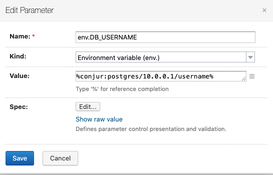

# 1603213635 teamcity-conjur-integration-road-map
It would be nice to be able to retrieve credentials from conjur when a teamcity build/pipeline is kicked off.

The solution should be similiar to hashicorp solutions:
- plugin: https://plugins.jetbrains.com/plugin/10011-hashicorp-vault-support
- github: https://github.com/JetBrains/teamcity-hashicorp-vault-plugin
- blog: https://blog.jetbrains.com/teamcity/2017/09/vault/


To create this integration its a 2 pronged solution:

## Project Connection
Each project has its own connection area, this area will contain the configuration to connect to conjur. [Hashicorp example can be found here](https://blog.jetbrains.com/wp-content/uploads/2017/09/teamcity-1.png)
The following properties will need to be required in order to connect into conjur:
| Field  | Default value | Example value |
| ------------- | ------------- | ------------- |
| Connection Type  | CyberArk Conjur | N/A |
| Display Name  | Conjur  | Conjur 1 |
| Conjur Appliance URL | https://localhost | https://conjur-follower.company.local |
| Conjur Account | default | companyName |
| Conjur Authn Login | host/teamcity | host/teamcity/project1 |
| Conjur API Key | ******** | ************* |
| Conjur Certificate | Copy and Paste the content of the certificate | N/A |
| Fail on Error (checkbox) | No | Yes |


## Build/Project Parameter
Since all Conjur configuration is stored within the Project Connection the only thing we need to specific in the TeamCity Parameter is the variable ID to the secret.
The value should look like the following:
```
Value: %conjur:path/to/secret/username%
```

This is a screen shot for what it should look like:



## Links
- [.1603214148-teamcity-edit-project.png](.1603214148-teamcity-edit-project.png)
- [.1603214159-teamcity-general-settings.png](.1603214159-teamcity-general-settings.png)
- [.1603214168-teamcity-add-connection.png](.1603214168-teamcity-add-connection.png)
- [.1603215167-teamcity-paramater.png](.1603215167-teamcity-paramater.png)
